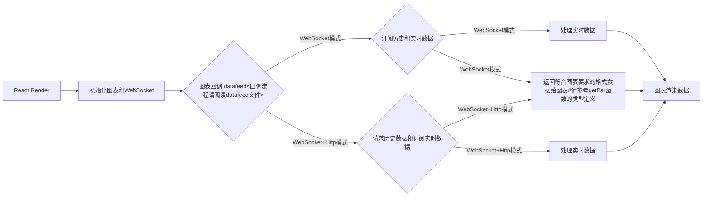

# 2022-08-03
主分支 demo 使用 tvadingview v20.033 (internal id 9df149da @ 2021-11-17T10:20:51.511Z)版本，[charting_library](https://tradingview.com)文件请访问 tradingview 官网获取，如需使用或浏览旧版，请切换分支查看。被问及比较多的问题我会在[datafeed](https://github.com/472647301/tradingview-web-socket/blob/master/tv-react/src/datafeed/index.ts)里添加注释。官方默认的datafeed是通过http获取历史数据，然后通过轮询http接口获取实时数据。如果无需使用WebSocket推送数据建议直接参考官方demo，申请图表成功之后可访问官方仓库。

- WebSocket模式 - [意思是实时数据跟历史数据都通过WebSocket获取，因为WebSocket是通过通知响应的，所以这种模式需要对getBar做特殊处理](https://tradingview.com)
- WebSocket+Http模式 - [意思是实时数据通过WebSocket获取，历史数据通过axios,fetch等获取](https://tradingview.com)

## 流程图

## Example

[react demo](http://test.byronzhu.com/tv-react)

## Task list
- [x] add react demo
- [ ] add vue demo:

## Screenshot

