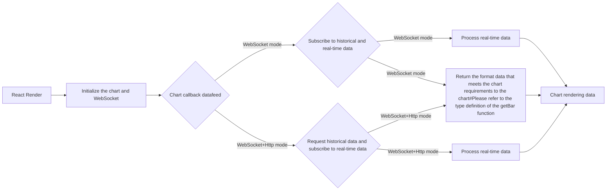

# 2022-08-03
-English | [简体中文](./README-zh_CN.md) | [繁體中文](./README-zh_TW.md)

The main branch demo uses the version of tvadingview v20.033 (internal id 9df149da @ 2021-11-17T10:20:51.511Z), the [charting_library](https://tradingview.com) file, please visit the official website of tradingview to get it, if you need to use or browse Old version, please switch branch to view. I will add comments to the [datafeed](https://github.com/472647301/tradingview-web-socket/blob/master/tv-react/src/datafeed/index.ts) when I am asked more questions. The official default datafeed is to obtain historical data through http, and then obtain real-time data through the polling http interface. If you do not need to use WebSocket to push data, it is recommended to directly refer to the official demo. After the application chart is successful, you can visit the official warehouse.

- WebSocket mode - [meaning that both real-time data and historical data are obtained through WebSocket, because WebSocket responds through notifications, so this mode requires special processing for getBar](https://tradingview.com)
- WebSocket+Http mode - [meaning that real-time data is obtained through WebSocket, and historical data is obtained through axios, fetch, etc.](https://tradingview.com)

## Flowchart

## Example

[react demo](http://test.byronzhu.com/tv-react)

## Task list
- [x] add react demo
- [ ] add vue demo:

## Screenshot

